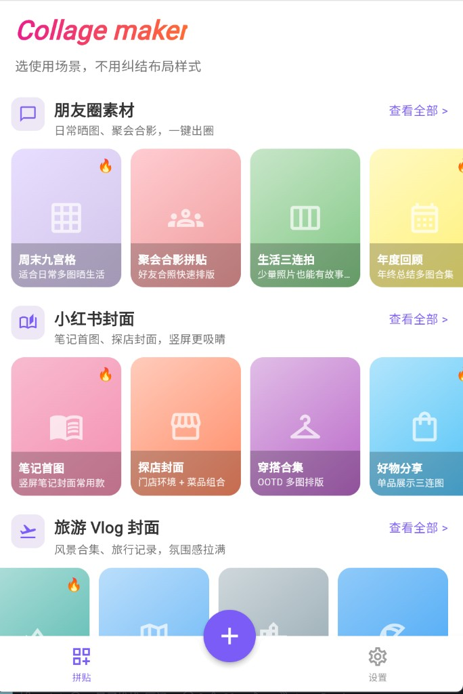
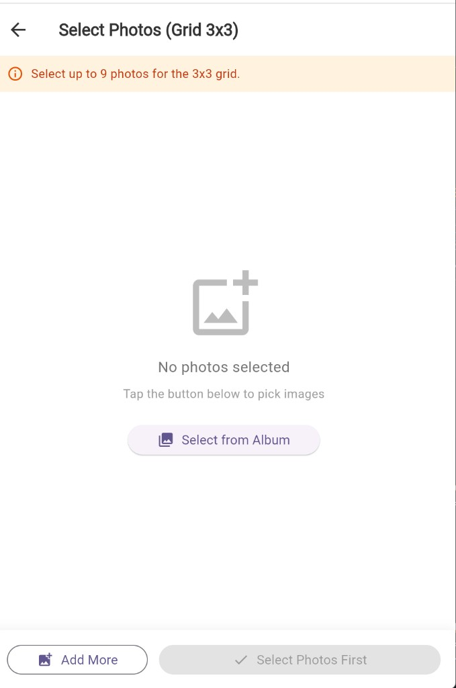
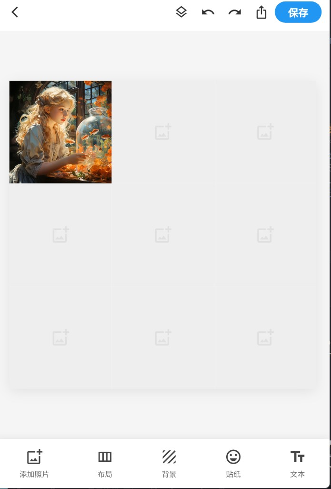

# 拼图相册（Collage Maker）

一款基于 Flutter 开发的跨平台图片拼图工具，支持从相册选择图片，快速生成九宫格拼图和横向三栏拼图，并导出分享至社交平台。同时支持 **Android / iOS / Web** 多端运行。

## 产品演示

| 首页模板浏览 | 相册选图 | 拼图编辑 |
|:---:|:---:|:---:|
|  |  |  |
| 分类模板 + 底部快捷入口 | 多选图片、拖拽排序 | 布局 / 背景 / 保存导出 |

## 产品定位

面向社交媒体用户（Instagram / 小红书 / TikTok）、日常照片整理用户和内容创作者，降低拼图门槛，几步完成拼图，提升社交内容美观度。
后续可扩展vlog视频封面，口播封面，信息流视频封面等

## 功能特性

### 已实现

| 功能 | 说明 |
|------|------|
| 模板首页 | 网格、经典、IG 限时动态、足球杯等分类模板横向浏览 |
| 快捷创建 | 底部 **+** 按钮一键从相册选图并进入编辑 |
| 相册选图 | 支持多选图片（九宫格最多 9 张 / 三栏最多 3 张），可拖拽调整顺序 |
| 九宫格拼图 | 3×3 网格布局，支持间距、圆角、背景色调整 |
| 三栏拼图 | 横向三等分布局，适用于对比图和产品展示 |
| 拼图编辑器 | 添加照片、切换布局、背景色、保存导出（贴纸 / 文本预留入口） |
| 图片导出 | 高清 PNG 导出（3x 像素比），移动端保存到本地，Web 端浏览器下载 |
| 系统分享 | 支持通过 share_plus 分享拼图成品 |
| Web 支持 | 浏览器端选图、预览、编辑、下载全流程可用 |

### 编辑器功能

- **添加照片**：编辑过程中继续从相册追加图片
- **布局切换**：九宫格 / 三栏横拼，间距 0 / 2 / 4 px，圆角 0 / 8 / 16
- **背景色**：6 种预设颜色（白色、黑色、暖橙、浅绿、浅蓝、浅粉）
- **图片排序**：选图页拖拽调整显示顺序
- **空位填充**：图片不足时自动显示占位图标
- **保存导出**：右上角「保存」按钮生成 PNG 并进入导出页

### 后续可扩展方向

- 贴纸、文本叠加
- 撤销 / 重做
- 滤镜系统（黑白 / 暖色 / 胶片）
- 裁剪、旋转、缩放编辑
- JSON 驱动的模板系统
- AI 自动排版、模板商店、云同步

## 技术架构

### 技术栈

| 模块 | 技术选型 |
|------|----------|
| 框架 | Flutter (Material 3) |
| 状态管理 | Provider |
| 图片选择 | image_picker |
| 图片渲染 | Image.memory + RepaintBoundary + dart:ui |
| 文件存储 | path_provider（移动端）/ 浏览器下载（Web） |
| 图片分享 | share_plus |
| 权限管理 | permission_handler |

### 架构分层

```
UI 层（Pages / Widgets）
        ↓
状态管理层（PuzzleProvider - ChangeNotifier）
        ↓
拼图渲染层（GridView / Row + RepaintBoundary）
        ↓
图片处理层（内存字节 + dart:ui toImage + PNG 编码）
        ↓
存储层（path_provider / Web 下载）
```

## 项目结构

```
lib/
├── main.dart                      # 应用入口，Provider 注册 + 主题配置
├── models/
│   └── selected_image.dart        # 图片模型 + 布局类型枚举
├── providers/
│   └── puzzle_provider.dart       # 核心状态管理（图片列表、样式参数）
├── pages/
│   ├── home_page.dart             # 首页（模板分类 + 底部导航 + 创建入口）
│   ├── picker_page.dart           # 图片选择页（多选 + 拖拽排序）
│   ├── collage_edit_page.dart     # 拼图编辑器（布局 / 背景 / 保存）
│   ├── grid_edit_page.dart        # 3×3 九宫格编辑器（备用）
│   ├── row_edit_page.dart         # 横向三栏编辑器（备用）
│   └── export_page.dart           # 导出页（预览 + 保存 + 分享）
├── widgets/
│   └── puzzle_image.dart          # 跨平台图片组件（Web / 移动端通用）
└── utils/
    ├── image_exporter.dart        # 拼图捕获工具
    ├── image_save_io.dart         # 移动端文件保存
    └── image_save_web.dart        # Web 端浏览器下载
```

### 页面导航流程

```
首页 (HomePage)
  ├── 点击模板分类 / 查看全部
  │     ↓
  ├── 图片选择页 (PickerPage)
  │     ↓
  ├── 拼图编辑页 (CollageEditPage)
  │     ↓
  └── 导出页 (ExportPage)

首页底部 + 按钮
  ├── 相册选图
  │     ↓
  └── 拼图编辑页 (CollageEditPage)
```

## 环境要求

- Flutter SDK >= 3.12.1
- Dart SDK >= 3.12.1
- Android: minSdkVersion 21+
- iOS: 12.0+
- Web: Chrome / Edge 等现代浏览器

## 快速开始

### 1. 进入项目目录

```bash
cd Puzzle-Factory
```

### 2. 安装依赖

```bash
flutter pub get
```

### 3. 运行项目

```bash
# Web 端（推荐本地预览）
flutter run -d chrome --web-port=8080 --web-hostname=127.0.0.1

# 或使用项目自带脚本（Windows）
start-web.bat

# 移动端
flutter run

# 指定设备
flutter run -d <device_id>
```

> **说明：** 若 Flutter 安装在 `E:/flutter` 且出现 git 权限报错，请先执行：
> `git config --global --add safe.directory E:/flutter`

### 4. 构建发布版本

```bash
# Web
flutter build web

# Android APK
flutter build apk --release

# Android App Bundle
flutter build appbundle --release

# iOS
flutter build ios --release
```

## 平台权限配置

### Android

已配置以下权限（`AndroidManifest.xml`）：

- `READ_EXTERNAL_STORAGE` - 读取相册图片
- `WRITE_EXTERNAL_STORAGE` - 保存图片（API <= 32）
- `READ_MEDIA_IMAGES` - 读取图片（API >= 33）
- `CAMERA` - 相机权限

### iOS

已配置以下权限（`Info.plist`）：

- `NSCameraUsageDescription` - 相机使用说明
- `NSPhotoLibraryUsageDescription` - 相册读取说明
- `NSPhotoLibraryAddUsageDescription` - 相册保存说明

## 使用说明

1. 打开应用，在首页浏览 **网格 / 经典 / IG 限时动态** 等模板分类
2. 点击 **查看全部** 或模板卡片，进入选图页；或直接点击底部 **+** 从相册选图
3. 选择图片（九宫格最多 9 张 / 三栏最多 3 张），可拖拽调整顺序
4. 进入编辑页，使用底部工具栏：
   - **添加照片** — 继续选图
   - **布局** — 切换九宫格 / 三栏，调整间距与圆角
   - **背景** — 选择背景色
5. 点击右上角 **保存**，生成高清 PNG
6. 在导出页 **下载图片**（Web）或 **Save to Album**（移动端），也可 **Share** 分享

## 依赖说明

| 包名 | 版本 | 用途 |
|------|------|------|
| `image_picker` | ^1.1.2 | 从相册多选图片 |
| `provider` | ^6.1.2 | 全局状态管理 |
| `path_provider` | ^2.1.4 | 获取本地文件路径 |
| `permission_handler` | ^11.3.1 | 运行时权限请求 |
| `share_plus` | ^9.0.0 | 系统分享功能 |

## 许可证

本项目仅供学习参考使用。
