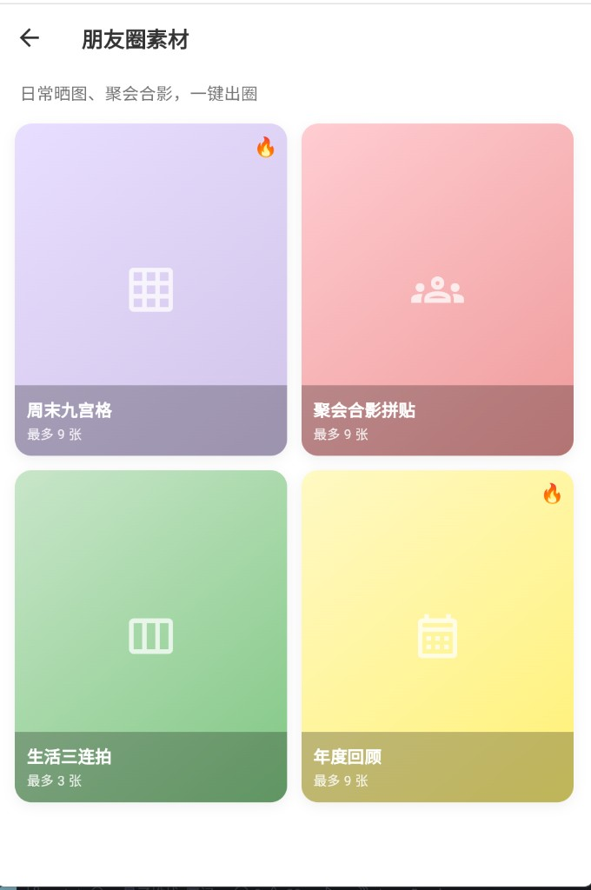

# 拼图相册（Collage Maker）

一款基于 Flutter 开发的跨平台图片拼图工具。用户**按使用场景**（朋友圈、小红书、旅游 Vlog 等）选择热门例图，无需思考布局样式，几步完成拼图并导出分享。支持 **Android / iOS / Web** 多端运行。

## 产品演示

完整创作流程：**选场景 → 选例图 → 上传图片 → 编辑导出**

| 场景首页 | 栏目页 | 图片上传页 | 编辑页 |
|:---:|:---:|:---:|:---:|
|  |  |  |  |
| 按使用场景浏览热门例图 | 进入栏目查看全部例图 | 展示场景信息，从相册选图 | 已选图预览，点击「开始创作」 |

**首页** — 5 大场景栏目横向展示热门例图， slogan「选使用场景，不用纠结布局样式」。

**栏目页** — 点击「查看全部」进入，如「朋友圈素材」下的周末九宫格、聚会合影拼贴等。

**图片上传页** — 选定例图后自动匹配布局，顶部显示场景与用途说明，支持多选、排序。

**编辑页** — 选图完成后预览列表，确认无误后点击「开始创作」，进入拼图编辑器。

## 产品定位

面向社交媒体用户（微信朋友圈 / 小红书 / 抖音）、内容创作者和中小商户，降低拼图门槛——**先选场景，再选例图**，系统自动匹配布局与样式，让用户专注内容而非排版。

## 场景栏目

首页按**使用场景**组织，每个栏目收录多组热门例图，点击即可开始创作：

| 场景栏目 | 适用说明 | 热门例图示例 |
|----------|----------|--------------|
| 朋友圈素材 | 日常晒图、聚会合影 | 周末九宫格、聚会合影拼贴、生活三连拍、年度回顾 |
| 小红书封面 | 笔记首图、探店封面 | 笔记首图、探店封面、穿搭合集、好物分享 |
| 旅游 Vlog 封面 | 风景合集、旅行记录 | 风景三联、旅行九宫格、城市漫步、假日回忆 |
| 美食店铺分享 | 菜品展示、门店打卡 | 招牌三连、菜单九宫格、探店打卡、套餐展示 |
| 产品对比图 | 前后对比、多色展示 | 前后对比、多色展示、细节九宫格、卖点三联 |

> 例图在内部自动映射九宫格 / 三栏布局、间距、圆角与背景色，用户无需手动选择布局样式。

## 功能特性

### 已实现

| 功能 | 说明 |
|------|------|
| 场景化首页 | 5 大使用场景栏目，每栏横向展示热门例图 |
| 热门例图 | 每个场景 4+ 组预设模板，带场景说明与 🔥 标记 |
| 查看全部 | 进入场景图库页，浏览该栏目全部例图 |
| 快捷创建 | 底部 **+** 按钮自由选图创作（不绑定场景） |
| 相册选图 | 支持多选图片（九宫格最多 9 张 / 三栏最多 3 张），可拖拽排序 |
| 拼图编辑器 | 添加照片、切换布局、背景色、保存导出 |
| 图片导出 | 高清 PNG 导出（3x 像素比），移动端保存 / Web 端下载 |
| 系统分享 | 支持通过 share_plus 分享拼图成品 |
| Web 支持 | 浏览器端选图、预览、编辑、下载全流程可用 |

### 编辑器功能

- **添加照片**：编辑过程中继续从相册追加图片
- **布局切换**：高级用户仍可手动切换九宫格 / 三栏，调整间距与圆角
- **背景色**：6 种预设颜色
- **保存导出**：右上角「保存」生成 PNG

### 后续可扩展方向

- 更多场景：口播封面、信息流视频封面、电商主图等
- 例图封面使用真实热门作品缩略图
- JSON / 云端驱动的场景模板库
- 贴纸、文本、滤镜、撤销重做
- AI 根据场景自动推荐例图

## 技术架构

### 技术栈

| 模块 | 技术选型 |
|------|----------|
| 框架 | Flutter (Material 3) |
| 状态管理 | Provider |
| 场景模板 | ScenarioCatalog 数据驱动 |
| 图片选择 | image_picker |
| 图片渲染 | Image.memory + RepaintBoundary + dart:ui |
| 文件存储 | path_provider（移动端）/ 浏览器下载（Web） |
| 图片分享 | share_plus |

### 架构分层

```
UI 层（HomePage / ScenarioGallery / Picker / Editor）
        ↓
场景模板层（ScenarioCatalog → ScenarioTemplate）
        ↓
状态管理层（PuzzleProvider - 场景 + 布局 + 图片）
        ↓
拼图渲染层（GridView / Row + RepaintBoundary）
        ↓
图片处理层（内存字节 + dart:ui toImage + PNG 编码）
```

## 项目结构

```
lib/
├── main.dart
├── models/
│   ├── selected_image.dart        # 图片模型 + 布局枚举
│   └── scenario_template.dart     # 场景栏目 + 热门例图数据
├── providers/
│   └── puzzle_provider.dart       # 场景应用、图片与样式状态
├── pages/
│   ├── home_page.dart             # 场景化首页
│   ├── scenario_gallery_page.dart # 栏目页（场景例图图库）
│   ├── picker_page.dart           # 图片上传页（场景提示 + 选图）
│   ├── collage_edit_page.dart     # 拼图编辑页
│   └── export_page.dart           # 导出页
├── widgets/
│   └── puzzle_image.dart          # 跨平台图片组件
└── utils/
    ├── image_exporter.dart
    ├── image_save_io.dart
    └── image_save_web.dart
```

### 页面导航流程

```
场景首页（HomePage）
  ├── 点击热门例图 → 图片上传页（PickerPage）→ 拼图编辑页 → 导出页
  ├── 查看全部 → 栏目页（ScenarioGalleryPage）→ 图片上传页 → 编辑页 → 导出页
  └── 底部 + → 自由创作 → 图片上传页 → 编辑页 → 导出页
```

## 环境要求

- Flutter SDK >= 3.12.1
- Dart SDK >= 3.12.1
- Android: minSdkVersion 21+
- iOS: 12.0+
- Web: Chrome / Edge 等现代浏览器

## 快速开始

### 1. 进入项目目录

```bash
cd Puzzle-Factory
```

### 2. 安装依赖

```bash
flutter pub get
```

### 3. 运行项目

```bash
# Web 端（推荐本地预览）
flutter run -d chrome --web-port=8080 --web-hostname=127.0.0.1

# 或使用项目自带脚本（Windows）
start-web.bat

# 移动端
flutter run
```

> **说明：** 若 Flutter 安装在 `E:/flutter` 且出现 git 权限报错，请先执行：
> `git config --global --add safe.directory E:/flutter`

### 4. 构建发布版本

```bash
flutter build web
flutter build apk --release
flutter build appbundle --release
flutter build ios --release
```

## 使用说明

1. **场景首页**：浏览 5 大使用场景（朋友圈素材、小红书封面等），横向滑动查看热门例图
2. **栏目页**：点击「查看全部」进入该场景图库，选择更合适的例图（如「周末九宫格」「聚会合影拼贴」）
3. **图片上传页**：系统已自动匹配布局与样式，点击「从相册选择」上传图片，可拖拽排序
4. **编辑页**：预览已选图片列表，点击「开始创作」进入拼图编辑器
5. **编辑导出**：微调布局 / 背景，点击右上角「保存」生成 PNG，下载或分享

## 依赖说明

| 包名 | 版本 | 用途 |
|------|------|------|
| `image_picker` | ^1.1.2 | 从相册多选图片 |
| `provider` | ^6.1.2 | 全局状态管理 |
| `path_provider` | ^2.1.4 | 获取本地文件路径 |
| `permission_handler` | ^11.3.1 | 运行时权限请求 |
| `share_plus` | ^9.0.0 | 系统分享功能 |

## 许可证

本项目仅供学习参考使用。
